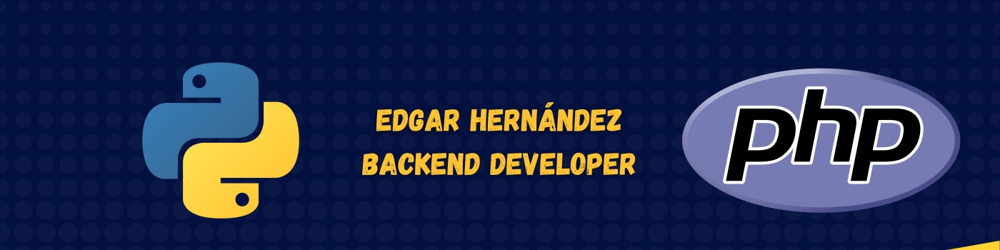

# ¡Hola, soy Edgar!


## Un poco sobre mí...
Desarrollador Backend 💻 con mas de 4 años de experiencia con Python, C#, Php y Javascript. Tecnologías como Django y Laravel. Manejo tecnologías Devops como CI/CD en Azure, Azure functions y AWS lambda (Serverless functions), manejo de EC2 en aws, DB RDS y otras más. Manejo de bases de datos Microsoft SQL Server y Mysql. Excelente manejo del ecosistema Linux (Ubuntu, Fedora, Red Hat), además de excelente manejo en Docker 🐋. Experiencia en sitema de control de versiones git. 

💼Me encargado de desarrollar proyectos a la medida, asi he sido lider de proyecto y he tenido a cargo mas de 10 proyectos, con empresas reconocidas.

⭐Estudiante de Ingeniería de Sistemas con un gran interés y manejo hacia lo sistemas operativos. Tengo un excelente manejo de sistemas operativos Linux 🐧 y experiencia en despliegue y manejos de tecnologías Devops (AWS, Azure Devops).

🗣️Poseo habilidades blandas como la resolución der conflictos, comunicación efectiva, muy responsable y sobre todo capacidad de trabajo en equipo.

## Proyectos

<table style="width: 100%; border-collapse: collapse; text-align: left;">
  <thead>
    <tr style="border-bottom: 2px solid #ddd;">
      <th style="padding: 10px; border-bottom: 1px solid #ddd;"><b>Proyecto</b></th>
      <th style="padding: 10px; border-bottom: 1px solid #ddd;"><b>Status</b></th>
      <th style="padding: 10px; border-bottom: 1px solid #ddd;"><b>Tech</b></th>
    </tr>
  </thead>
  <tbody>
    <tr>
      <td style="padding: 10px; border-bottom: 1px solid #ddd;">Reverse Proxy</td>
      <td style="padding: 10px; border-bottom: 1px solid #ddd;">💪</td>
      <td style="padding: 10px; border-bottom: 1px solid #ddd;">Go</td>
    </tr>
    <tr>
      <td style="padding: 10px; border-bottom: 1px solid #ddd;">hubspot-file-uploader</td>
      <td style="padding: 10px; border-bottom: 1px solid #ddd;">💪</td>
      <td style="padding: 10px; border-bottom: 1px solid #ddd;">Python</td>
    </tr>
    <tr>
      <td style="padding: 10px; border-bottom: 1px solid #ddd;">react-mirror</td>
      <td style="padding: 10px; border-bottom: 1px solid #ddd;">✅</td>
      <td style="padding: 10px; border-bottom: 1px solid #ddd;">JavaScript</td>
    </tr>
  </tbody>
</table>

## Un estudiante aplicado...

```
$ echo >> "studying and working 💪"
```

Actualmente me encuentro estudiando la carrera de Ingeniería de Sistemas. Aquí alguno de mis avances:

 ### Matemáticas
 **Vídeo Ecuaciones**
 [](https://www.youtube.com/watch?v=Gf0LndIZ31c)
 **Vídeo Trigonometría**
  [](https://www.youtube.com/watch?v=rY__YP538qc)


